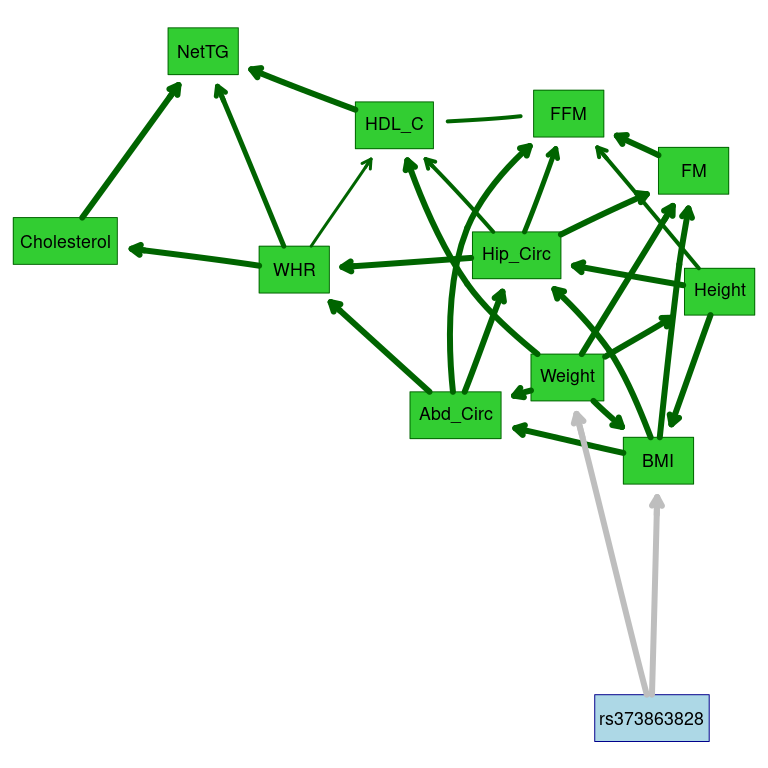
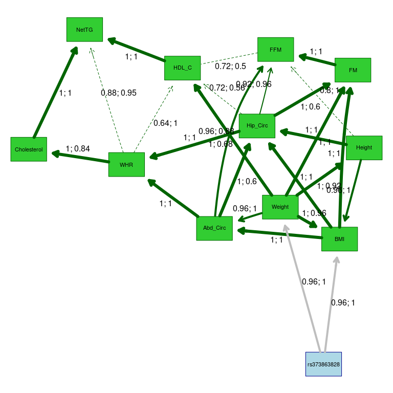
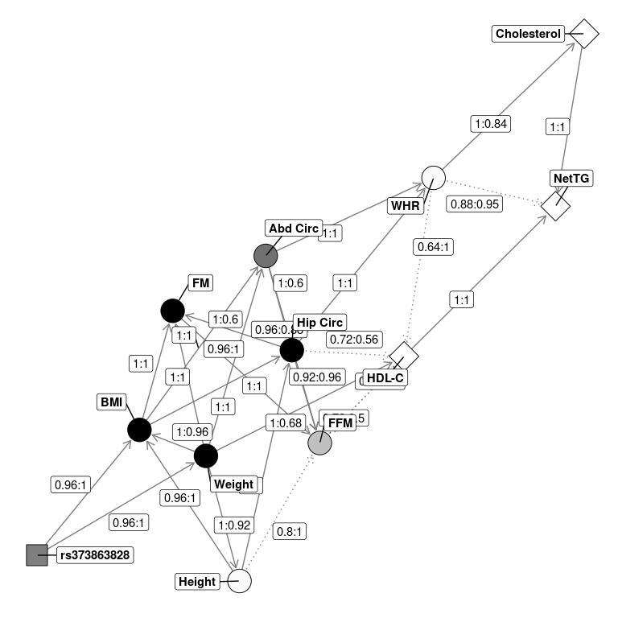

Multivariate Analysis Publication Code Part 2: Bayesian Networks
================
Jerry Z. Zhang, Lacey W. Heinsberg, and Daniel E. Weeks<br/>Department
of Human Genetics<br/>University of Pittsburgh


# Overview

Copyright 2022, University of Pittsburgh. All Rights Reserved.  
License: CC BY-SA 3.0
([link](https://creativecommons.org/licenses/by-sa/3.0/))

Here we illustrate how we estimated our Bayesian Networks.

As laid out in our README.md, this .Rmd file builds upon another example
.Rmd file

`01_phenotypes_mvBIMBAM_run.Rmd`,

which will need to be ran first as it creates two data files that are
read in below.

As stated in our README.md, the code within this document was adapted
from <http://www.bnlearn.com/research/genetics14/> under the Creative
Commons Attribution-Share Alike
License(<https://creativecommons.org/licenses/by-sa/3.0/>) which
accompanies the paper “Multiple Quantitative Trait Analysis Using
Bayesian Networks” by Scutari, Howell, Balding, Mackay (Genetics, 2014).

# Load Libraries

``` r
library(tidyverse)
library(lme4)
library(bnlearn)
library(parallel)
# The 'graph' package is a Bioconductor package.
library(graph)
library(pander)
library(ggnetwork)
# The 'Rgraphviz' is a Bioconductor packaage.
library(Rgraphviz)
```

# Read in the synthetic dataset

Please see the README.md for information regarding the example synthetic
data set and pre-processing instructions if you will be adapting this
code to perform the analyses in your own data set.

As detailed in the README.md and demonstrated in
`01_phenotypes_mvBIMBAM_run.Rmd`, the synthetic phenotype data created
for this example .Rmd were adjusted for age and sex, quantile
normalized, and outliers were removed. The quantile normalized adjusted
data set is read in below.

``` r
# Read in the quantile normalized adjusted synthetic data set 
# (Created for use with this example analysis code and processed in the 
# previous .Rmd)
df_synth <- readRDS("SyntheticQuantNorm.rds") %>%
    mutate(rs373863828 = case_when(rs373863828 == "AA" ~ 2,
                                   rs373863828 == "AG" ~ 1,
                                   rs373863828 == "GG" ~ 0))

# The package to learn the Bayesian networks (bnlearn) does not support integer data,
# so convert integer columns to numeric
df_synth[sapply(df_synth, class) == "integer"] <- 
  sapply(df_synth[sapply(df_synth, class) == "integer"], as.numeric)
```

``` r
# Define the phenotypes of interest
# Anthropometry
anthro.traits <- c("BMI", "Height", "Weight", "FFM", "FM", "WHR", "Abd_Circ", "Hip_Circ")
# Lipids
lipids.traits <- c("HDL_C", "NetTG", "Cholesterol")
# Both
traits <- c(anthro.traits, lipids.traits)
# Phenotype abbreviations
# BMI=body mass index; FFM=fat-free mass; FM=fat mass; WHR=waist hip ratio; 
# Abd_Circ=abdominal circumference; Hip_Circ=hip circumference; 
# HDL_C=HDL cholesterol; NetTG=net triglycerides

# Define variant of interest 
genes <- c("rs373863828")
```

Here we will analyze all traits which are loaded into the ‘traits’
object.

# Bayesian Network estimation

As described in our paper, we further explored the relationships between
the variant and the correlated phenotypes of interest with a Bayesian
network learned using the R package bnlearn. The final quantile
normalized data (created in `01_phenotypes_mvBIMBAM_run.Rmd` and loaded
above) are used to learn the Bayesian networks.

## Define function to fit the model

### fit.the.model

The Bayesian networks model is fitted by the fit.the.model() function
defined below. A constrained learning algorithm based on conditional
independence testing (semi-interleaved HITON-PC) is used to infer
association and potential causal relationships within the network.

In this approach “parent-child” relationships are learned based on
learn.nbr, which depends on ci.test (independence and conditional
independence tests). Phenotypes and the variant are modeled as nodes,
with edges representing associations between nodes. In our analyses
below, the “parents” of a trait can be either variants or other traits
while “children” can only be traits. In other words, the analyses are
restricted so the variant can have only outgoing edges connecting to
phenotypes, and phenotypes cannot act on gene(s). This is specified
through the use of the tiers2blacklist() function which creates a
“blacklist” that prevents arcs from going to specific nodes. This option
restricts the space of the candidate models with the intention of
forcing known causal relationships to flow in the right direction while
learning them from the data. Here we are only forcing the direction of
the flow from variant to traits (preventing trait to variants), but this
could be customized further as shown at
<http://www.bnlearn.com/research/genetics14/>.

Once networks are learned, the nodes are partitioned into subsets for
plotting and structures are learned by maximizing the Bayesian
Information Criteria (BIC).

``` r
# Define model function to return a Bayesian network based on a conditional correlation 
# test and si.hiton.pc structure learning algorithm
fit.the.model <- function(data, alpha) {
  cpc = vector(length(traits), mode = "list")
  names(cpc) = traits
  
  # Find the "parents" of each trait (which might be genes/variants or other traits)
  # The parents of a trait can be either markers or other traits
  # Children can only be traits
  # The test used to assess (conditional) independence is the exact t test for
  # Pearson' correlation (test = "cor") with the specified alpha threshold.
  for (t in seq_along(traits)) {
    # Discover parents
    cpc[[t]] = learn.nbr(
      data[, c(traits, genes)],
      node = traits[t],
      debug = FALSE,
      method = "si.hiton.pc",
      test = "cor",
      alpha = alpha
    )
  } #FOR
  # Merge the relevant variables to use for learning
  # Since we are performing a candidate SNP study, force in SNP of interest 
  # In the original code, markers that are not included in this list have not 
  # been found to be directly related to any trait and are therefore discarded 
  # from the analysis - which would be appropriate in a study of many genes/SNPs
  nodes = unique(c(traits, unlist(cpc), "rs373863828"))
  
  # Create a blacklist of edges
  # Manually define trait to gene
  # If the gene is not a node in the graph, run without a blacklist
  # Else no blacklist
  if ((!("rs373863828" %in% nodes))) {
  bn = hc(data[, c(nodes)])
  } else {
    blacklist = tiers2blacklist(list(nodes[!(nodes %in% traits)], traits))
    bn = hc(data[, c(nodes)], blacklist = blacklist)
  }
  return(bn)
} #FIT.THE.MODEL

# Create a function to train the model with n fold cross validation, 
# 100-100/n% train and 100/n% test for 10 partitions
# Hold out each partition iteratively so that no data are totally held out
xval.the.model <- function(data,
                          k = 10,
                          alpha = 0.15,
                          ridge,
                          verbose = F) {
  n = nrow(data)
  predcor = numeric(length(traits))
  names(predcor) = traits
  postcor = numeric(length(traits))
  names(postcor) = traits
  
  # Shuffle the data to get unbiased splits
  # Supress: data length is not a multiple of split variable
  # kcv = suppressWarnings(split(sample(n), seq_len(k)))
  
  # Stratified sampling by genotype
  list_strat = suppressWarnings(split(1:n, data$rs373863828) %>% lapply(split, seq_len(k)))
  # Shuffle the list so that group sizes are more random,
  # Otherwise first group will always be largest group
  # Up to levels(genotype) larger. This only ensures size
  # Instead of minimized group size difference
  list_strat = lapply(list_strat, function(x)
    x[sample(k)])
  kcv = sapply(1:k, function(i)
    c(list_strat[[1]][[i]],
      list_strat[[2]][[i]],
      list_strat[[3]][[i]]))
  names(kcv) = 1:length(kcv)
  
  # Store the length of each test set
  kcv.length = sapply(kcv, length)
  
  predicted = lapply(kcv, function(test) {
    # Create a matrix to store the predicted values
    pred = matrix(0, nrow = length(test), ncol = length(traits))
    colnames(pred) = traits
    # Create a matrix to store posterior estimates.
    post = matrix(0, nrow = length(test), ncol = length(traits))
    colnames(post) = traits
    
    if (verbose)
      cat("* beginning cross-validation fold.\n")
    
    # Split training and test
    dtraining = data[-test,]
    dtest = data[test,]
    # Fit the model on the training data
    model = fit.the.model(dtraining, alpha = alpha)
    fitted = bn.fit(model, dtraining[, nodes(model)], debug = F)
    # Maybe re-fit with ridge regression
    # Untested
    if (ridge) {
      if (verbose)
        cat("* re-fit with ridge regression")
      library(penalized)
      for (no in nodes(fitted)) {
        node.parents = parents(fitted, no)
        
        if (length(node.parents) < 3)
          next
        
        opt.lambda = optL2(
          response = dtraining[, no],
          penalized = dtraining[, node.parents],
          model = "linear",
          trace = FALSE,
          minlambda2 = 10e-5,
          maxlambda = 500
        )$lambda
        fitted[[no]] = penalized(
          response = dtraining[, no],
          penalized = dtraining[, node.parents],
          model = "linear",
          trace = FALSE,
          lambda1 = 0,
          lambda2 = opt.lambda
        )
        
      }
    }
    # Subset the test data
    dtest = dtest[, nodes(model)]
    # cat("Subset complete. \n")
    
    if (verbose)
      cat("  model has", length(nodes(model)), "nodes.\n")
    
    # Predict each trait in turn, given all the parents
    for (t in traits)
      pred[, t] = predict(fitted, node = t, data = dtest[, nodes(model)])
    # cat(" Predict each trait complete \n")
    
    for (i in seq(nrow(dtest)))
      post[i, traits] = colMeans(cpdist(
        fitted,
        nodes = traits,
        evidence = as.list(dtest[i, ])[names(dtest) %in% genes],
        method = "lw",
        n = 1000
      ))
    # cat(" Posterior calculation complete \n")
    
    return(list(
      model = fitted,
      pred = pred,
      post = post
    ))
    
  })
  
  # Merge all the predicted values
  posterior = do.call(rbind, lapply(predicted, `[[`, "post"))
  causal = do.call(rbind, lapply(predicted, `[[`, "pred"))
  
  if (verbose)
    cat("* overall cross-validated correlations:\n")
  for (t in traits) {
    predcor[t] = cor(causal[, t], data[unlist(kcv), t])
    if (verbose)
      cat("  PREDCOR(", t, "):", predcor[t], "\n")
    postcor[t] = cor(posterior[, t], data[unlist(kcv), t])
    if (verbose)
      cat("  POSTCOR(", t, "):", postcor[t], "\n")
    
  }
  return(
    list(
      predicted = causal,
      posterior = posterior,
      observed = data[unlist(kcv), t],
      predcor = predcor,
      postcor = postcor,
      models = lapply(predicted, `[[`, "model")
    )
  )
}
```

## Define plotting functions

### f_run_plot_graph

``` r
# Define function to plot the networks
f_run_plot_graph <- function(data = df_synth,
                            k = 5,
                            alpha = 0.01,
                            use.custom.threshold = FALSE,
                            custom.threshold = 0.90,
                            ncluster = 10,
                            ...) {
  cl = makeCluster(ncluster)
  invisible(clusterEvalQ(cl, library(bnlearn)))
  invisible(clusterEvalQ(cl, library(lme4)))
  clusterExport(cl = cl, c("traits", "genes", "fit.the.model"))
  pr001 = vector(k, mode = "list")
  for (i in seq_along(pr001))
    pr001[[i]] = xval.the.model(data,
                                k = k,
                                alpha = alpha,
                                ridge = FALSE,
                                ...)
  stopCluster(cl)
  
  pred.summary = sapply(pr001, `[[`, "predcor")
  print(rowMeans(pred.summary))
  post.summary = sapply(pr001, `[[`, "postcor")
  print(rowMeans(post.summary))
  # Average the network structures
  arclist = list()
  for (i in seq_along(pr001)) {
    # Extract the models
    run = pr001[[i]]$models
    for (j in seq_along(run))
      arclist[[length(arclist) + 1]] = arcs(run[[j]])
  }
  
  
  # Compute the arc strengths
  nodes = unique(unlist(arclist))
  # Note: default boot.strength() runs with "cpdag = TRUE" which means
  # reversible arcs can have positive strength in both directions
  # Use "cpdag = FALSE" to truly make the blacklist work as expected 
  strength = custom.strength(arclist, nodes = nodes, cpdag = FALSE)
  # Estimate the threshold and average the networks
  averaged = averaged.network(strength)
  # sna::degree will break code
  relevant.nodes = bnlearn::nodes(averaged)[sapply(nodes, bnlearn::degree, object = averaged) > 0]
  # igraph::subgraph will break code
  averaged2 = bnlearn::subgraph(averaged, relevant.nodes)
  strength2 = strength[(strength$from %in% relevant.nodes) &
                         +(strength$to %in% relevant.nodes),]
  cat("threshold: ", attr(strength2, "threshold"), "\n")
  t <- attr(strength2, "threshold")
  v <- strength2$strength
  cat("min strength > threshold: ", min(v[v > t]), "\n")
  cat("strength: ", sort(strength2$strength))
  if (use.custom.threshold) {
    cat("Using custom threshold of ", custom.threshold, "\n")
    gR = strength.plot(
      averaged2,
      strength2,
      shape = "rectangle",
      layout = "fdp",
      render = F,
      threshold = custom.threshold
    )
  } else {
    gR = strength.plot(
      averaged2,
      strength2,
      shape = "rectangle",
      layout = "fdp",
      render = F
    )
  }
  nodeRenderInfo(gR)$fill = "lightblue"
  nodeRenderInfo(gR)$col = "darkblue"
  nodeRenderInfo(gR)$fill[traits] = "limegreen"
  nodeRenderInfo(gR)$col[traits] = "darkgreen"
  a = arcs(bnlearn::subgraph(averaged, traits))
  a = as.character(interaction(a[, "from"], a[, "to"], sep = "~"))
  edgeRenderInfo(gR)$col = "grey"
  edgeRenderInfo(gR)$col[a] = "darkgreen"
  Rgraphviz::renderGraph(gR)
  results <-
    list(
      averaged2 = averaged2,
      strength2 = strength2,
      averaged = averaged,
      traits = traits,
      threshold = t
    )
  return(results)
}
```

### redraw.graph

``` r
# Define function to redraw plots 
redraw.graph <-
  function(averaged2,
           strength2,
           averaged,
           traits,
           custom.threshold) {
    gR = strength.plot(
      averaged2,
      strength2,
      shape = "rectangle",
      layout = "fdp",
      render = F,
      threshold = custom.threshold
    )
    nodeRenderInfo(gR)$fill = "lightblue"
    nodeRenderInfo(gR)$fill = "lightblue"
    nodeRenderInfo(gR)$col = "darkblue"
    nodeRenderInfo(gR)$fill[traits] = "limegreen"
    nodeRenderInfo(gR)$col[traits] = "darkgreen"
    a = arcs(bnlearn::subgraph(averaged, traits))
    a = as.character(interaction(a[, "from"], a[, "to"], sep = "~"))
    edgeRenderInfo(gR)$col = "grey"
    edgeRenderInfo(gR)$col[a] = "darkgreen"
    Rgraphviz::renderGraph(gR)
  }
```

### match.arcs.and.directions

``` r
# Define function to match arcs and directions 
match.arcs.and.directions <-
  function (arcs, nodes, strengths, keep = FALSE)
  {
    if (nrow(strengths) < nrow(arcs))
      stop("insufficient number of strength coefficients.")
    a_hash = interaction(arcs[, "from"], arcs[, "to"])
    s_hash = interaction(strengths[, "from"], strengths[, "to"])
    if (keep) {
      s = strengths[match(a_hash, s_hash), , drop = FALSE]
      coef = s$direction
    }
    else {
      s = strengths[match(a_hash, s_hash), "direction"]
      from = strengths[match(a_hash, s_hash), "from"]
      to = strengths[match(a_hash, s_hash), "to"]
      names(s) <- paste0(from, "~", to)
      coef = s
    }
    if (any(is.na(coef))) {
      missing = apply(arcs[is.na(coef), , drop = FALSE], 1,
                      function(x) {
                        paste(" (", x[1], ", ", x[2], ")", sep = "")
                      })
      stop(
        "the following arcs do not have a corresponding direction coefficients:",
        missing,
        "."
      )
    }
    return(s)
  }
```

### redraw.graph.labels

``` r
# Define function to redraw graph labels 
redraw.graph.labels <-
  function(averaged2,
           strength2,
           averaged,
           traits,
           custom.threshold) {
    gR = strength.plot(
      averaged2,
      strength2,
      shape = "rectangle",
      layout = "fdp",
      render = F,
      threshold = custom.threshold
    )
    x <- averaged2
    str <-
      match.arcs.and.directions(
        arcs = x$arcs,
        nodes = names(x$nodes),
        strengths = strength2
      )
    str2 = bnlearn:::match.arcs.and.strengths(
      arcs = x$arcs,
      nodes = names(x$nodes),
      strengths = strength2
    )
    # labels <- edgeNames(gR)
    labels2 <- paste0(round(str2, 2), "; ", round(str, 2))
    names(labels2) <- names(str)
    gR <-
      Rgraphviz::layoutGraph(gR,
                             edgeAttrs = list(label = labels2),
                             layoutType = "fdp")
    nodeRenderInfo(gR)$fill["rs373863828"] = "grey"
    nodeRenderInfo(gR)$fill = "lightblue"
    nodeRenderInfo(gR)$col = "darkblue"
    nodeRenderInfo(gR)$fill[traits] = "limegreen"
    nodeRenderInfo(gR)$col[traits] = "darkgreen"
    a = arcs(bnlearn::subgraph(averaged2, traits))
    a = as.character(interaction(a[, "from"], a[, "to"], sep = "~"))
    edgeRenderInfo(gR)$col = "grey"
    edgeRenderInfo(gR)$col[a] = "darkgreen"
    Rgraphviz::renderGraph(gR)
  }
```

### redraw.label.ggnet

``` r
# Define function to redraw the graph in ggnetwork/ggplot2 framework
redraw.label.ggnet <-
  function(averaged2,
           strength2,
           averaged,
           traits,
           df_bayes,
           ...) {
    # Relies on bnlearn code to return a directed graph
    x <- averaged2
    # Get the directions and str
    vec_dir <-
      match.arcs.and.directions(
        arcs = x$arcs,
        nodes = names(x$nodes),
        strengths = strength2
      )
    vec_str = bnlearn:::match.arcs.and.strengths(
      arcs = x$arcs,
      nodes = names(x$nodes),
      strengths = strength2
    )
    
    # Create data.frame with node/dir/str
    # Need to join this to the data.frame created by ggnetwork
    df_dir_str = data.frame(do.call(rbind, str_split(names(vec_dir), "~")),
                            vec_dir,
                            vec_str,
                            stringsAsFactors = F)
    names(df_dir_str)
    
    # Convert NEL graph to iGraph to ggnetwork data.frame
    # This step 'shuffles' the edge orders so vec_dir, vec_str is not in same order
    # as df_ggnetwork
    graph_igraph = igraph::igraph.from.graphNEL(as.graphNEL(averaged2))
    df_ggnetwork = ggnetwork(graph_igraph, ...)
    # df_ggnetwork$vertex.names = as.character(df_ggnetwork$vertex.names)
    df_ggnetwork$vertex.names = as.character(df_ggnetwork$name)
    df_ggnetwork$xend = as.numeric(df_ggnetwork$xend)
    df_ggnetwork$yend = as.numeric(df_ggnetwork$yend)
    df_ggnetwork$x = as.numeric(df_ggnetwork$x)
    df_ggnetwork$y = as.numeric(df_ggnetwork$y)
    
    # Data.frame of node coordinates, will need to this to figure out the
    # destination node/end vertex
    df_node_coord = df_ggnetwork %>%  filter(is.na(weight)) %>% select(vertex.names, x, y) %>%
      transmute(vertex.names.end = vertex.names,
                xend = x,
                yend = y)
    
    # Join back to form end vertex
    # Relies on fuzzyjoin with L2 norm < 0.05 since ggnetwork shifts node 
    # positions around randomly
    df_ggnetwork = df_ggnetwork %>%
      fuzzyjoin::distance_left_join(df_node_coord,
                                    by = c("xend", "yend"),
                                    max_dist = 0.05)
    
    # Join the dir/prob table
    # Based on source node and end node
    df_ggnetwork = df_ggnetwork %>% left_join(df_dir_str,
                                    by = c("vertex.names" = "X1", "vertex.names.end" = "X2"))
    
    # Add on Bayes factors
    df_ggnetwork = df_ggnetwork %>% left_join(df_bayes, by = "vertex.names")
    
    # Change formatting for some names
    df_ggnetwork$vertex.names[df_ggnetwork$vertex.names == "Abd_Circ"] = "Abd Circ"
    df_ggnetwork$vertex.names[df_ggnetwork$vertex.names == "Hip_Circ"] = "Hip Circ"
    df_ggnetwork$vertex.names[df_ggnetwork$vertex.names == "HDL_C"] = "HDL-C"
    df_ggnetwork$vertex.names[df_ggnetwork$vertex.names == "Cholesterol2"] = "Cholesterol"
    
    # Create a node type lookup table for node coloring
    df_vertex_table = data.frame(
      vertex.names = c(
        "BMI",
        "Height",
        "Weight",
        "FFM",
        "FM",
        "WHR",
        "Abd Circ",
        "Hip Circ",
        "HDL-C",
        "NetTG",
        "rs373863828",
        "Cholesterol"
      ),
      type = c(
        "Anthropometric",
        "Anthropometric",
        "Anthropometric",
        "Anthropometric",
        "Anthropometric",
        "Anthropometric",
        "Anthropometric",
        "Anthropometric",
        "Lipids",
        "Lipids",
        "Genotype",
        "Lipids"
      ),
      stringsAsFactors = F
    )
    
    # Join node type table
    df_ggnetwork = df_ggnetwork %>% left_join(df_vertex_table, by = "vertex.names")
    
    # Fix the data.frame column names, fuzzyjoin appended .x and .y to column names
    # names(df_ggnetwork) = c("x", "y", "na.x", "vertex.names", "xend", "yend", "na",
    #                        "weight", "vertex.names.end", "xend.y", "yend.y", "vec_dir",
    #                        "vec_str", "BF", "type")
    names(df_ggnetwork)[names(df_ggnetwork) == "xend.x"] <- "xend"
    names(df_ggnetwork)[names(df_ggnetwork) == "yend.x"] <- "yend"
    
    # Function to ceiling the bayes factor at v (5 in this case)
    f_ceil = function(x, v) {
      x[x > v] = v
      x
    }
    # Plot with ggplot and ggnetwork geoms
    ggplot(df_ggnetwork, aes(
      x = x,
      y = y,
      xend = xend,
      yend = yend
    )) +
      geom_edges(aes(linetype = (vec_str > 0.9)),
                 color = "grey50",
                 arrow = arrow(length = unit(8, "pt"), type = "open")) +
      geom_nodes(size = 10,
                 aes(shape = type, fill = f_ceil(BF, 5)),
                 color = "black") +
      geom_edgelabel_repel(aes(label = paste0(
        round(vec_str, 2), ":", round(vec_dir, 2)
      ))) +
      geom_nodelabel_repel(
        aes(label = vertex.names),
        force = 1,
        fontface = "bold",
        box.padding = unit(1.2, "lines"),
        color = "black"
      ) +
      scale_fill_gradientn("Node Type",
                           colors = c("white", "grey", "black"),
                           limits = c(0, 5)) +
      scale_linetype_manual(
        "Node Signif.",
        values = c("FALSE" = "dotted", "TRUE" = "solid"),
        label = c("<= 90 Strength", "> 0.90 Strength")
      ) +
      scale_shape_manual(values = c(21:23)) + theme_blank(legend.position = "none")
  }
```

## mvBIMBAM results

The Bayes factors calculated by mvBIMBAM in the previous .Rmd are used
to color the nodes in the final graph.

When reading setting up the Bayes factors for coloring, set negative
BF’s to zero.

``` r
# Load mvBIMBAM results calculated from mvBIMBAM runs
# Used only for plotting purposes
load('mvBimBam_Results.RDdata', verbose = TRUE)
```

    ## Loading objects:
    ##   m1
    ##   m2
    ##   table1

``` r
results <- data.frame(vertex.names = colnames(m1),BF = t(m1))
rownames(results) <- NULL
df_bayes_expand <- results[-c(1:2),]
rownames(df_bayes_expand) <- NULL
# Set negative BF's to zero 
df_bayes_expand$BF[df_bayes_expand$BF<0] <- 0
kable(df_bayes_expand, caption= "Bayes factors as estimated by mvBIMBAM")
```

| vertex.names |      BF |
|:-------------|--------:|
| BMI          | 7.44413 |
| Height       | 0.19346 |
| Weight       | 5.49124 |
| FFM          | 2.40668 |
| FM           | 5.86814 |
| WHR          | 0.18422 |
| Abd_Circ     | 3.44936 |
| Hip_Circ     | 6.31858 |
| HDL_C        | 0.00000 |
| NetTG        | 0.00000 |
| Cholesterol  | 0.00000 |

Bayes factors as estimated by mvBIMBAM

# Results

## Data summaries

``` r
# Check dimensions of the synthetic data used here 
dim(df_synth)
```

    ## [1] 1356   12

``` r
# Summary of data
summary(df_synth)
```

    ##   rs373863828          BMI               Height             Weight        
    ##  Min.   :0.0000   Min.   :-49.3494   Min.   :-49.3494   Min.   :-49.3494  
    ##  1st Qu.:0.0000   1st Qu.:-13.8366   1st Qu.:-13.9033   1st Qu.:-13.9033  
    ##  Median :0.0000   Median : -1.6261   Median : -1.9481   Median : -1.5709  
    ##  Mean   :0.5361   Mean   :  0.3903   Mean   :  0.1986   Mean   :  0.3395  
    ##  3rd Qu.:1.0000   3rd Qu.: 11.2919   3rd Qu.: 11.2332   3rd Qu.: 11.2919  
    ##  Max.   :2.0000   Max.   :151.5049   Max.   :151.5049   Max.   :151.5049  
    ##       FFM                  FM                WHR              Abd_Circ       
    ##  Min.   :-49.34942   Min.   :-49.3494   Min.   :-49.3494   Min.   :-49.3494  
    ##  1st Qu.:-14.10627   1st Qu.:-13.7759   1st Qu.:-13.9973   1st Qu.:-13.7234  
    ##  Median : -2.40400   Median : -1.6261   Median : -1.9361   Median : -1.4368  
    ##  Mean   : -0.01652   Mean   :  0.3376   Mean   :  0.1208   Mean   :  0.4066  
    ##  3rd Qu.: 10.93342   3rd Qu.: 11.4142   3rd Qu.: 11.0231   3rd Qu.: 11.3717  
    ##  Max.   :151.50491   Max.   :151.5049   Max.   :151.5049   Max.   :151.5049  
    ##     Hip_Circ            HDL_C               NetTG           Cholesterol       
    ##  Min.   :-49.3494   Min.   :-49.34942   Min.   :-49.3494   Min.   :-49.34942  
    ##  1st Qu.:-13.7999   1st Qu.:-14.16725   1st Qu.:-14.1307   1st Qu.:-13.97325  
    ##  Median : -1.5492   Median : -2.12963   Median : -1.8848   Median : -2.09169  
    ##  Mean   :  0.4109   Mean   : -0.01787   Mean   :  0.1294   Mean   : -0.01349  
    ##  3rd Qu.: 11.4142   3rd Qu.: 10.94681   3rd Qu.: 11.0820   3rd Qu.: 10.96894  
    ##  Max.   :151.5049   Max.   :151.50491   Max.   :151.5049   Max.   :151.50491

``` r
# Correlation structure of data
cor(df_synth[,traits])
```

    ##                     BMI      Height      Weight         FFM          FM
    ## BMI          1.00000000  0.05654999  0.89115448 -0.77803102  0.90689781
    ## Height       0.05654999  1.00000000  0.34823176 -0.13094969  0.26978131
    ## Weight       0.89115448  0.34823176  1.00000000 -0.77086403  0.95703031
    ## FFM         -0.77803102 -0.13094969 -0.77086403  1.00000000 -0.80125959
    ## FM           0.90689781  0.26978131  0.95703031 -0.80125959  1.00000000
    ## WHR          0.35825726  0.02561132  0.38019540 -0.38299136  0.35161851
    ## Abd_Circ     0.87050789  0.13256381  0.83692435 -0.74651551  0.84175720
    ## Hip_Circ     0.86795388  0.18805683  0.82552248 -0.74289334  0.85623153
    ## HDL_C       -0.29538767 -0.13061223 -0.32741249  0.30757979 -0.30175714
    ## NetTG        0.21113450  0.09693125  0.23353713 -0.22050883  0.21727328
    ## Cholesterol  0.05390981  0.01655032  0.05012822 -0.06355734  0.04560803
    ##                     WHR    Abd_Circ    Hip_Circ      HDL_C       NetTG
    ## BMI          0.35825726  0.87050789  0.86795388 -0.2953877  0.21113450
    ## Height       0.02561132  0.13256381  0.18805683 -0.1306122  0.09693125
    ## Weight       0.38019540  0.83692435  0.82552248 -0.3274125  0.23353713
    ## FFM         -0.38299136 -0.74651551 -0.74289334  0.3075798 -0.22050883
    ## FM           0.35161851  0.84175720  0.85623153 -0.3017571  0.21727328
    ## WHR          1.00000000  0.53958553  0.18112236 -0.2560829  0.27459864
    ## Abd_Circ     0.53958553  1.00000000  0.79772319 -0.3114177  0.25445384
    ## Hip_Circ     0.18112236  0.79772319  1.00000000 -0.2110896  0.13197904
    ## HDL_C       -0.25608291 -0.31141766 -0.21108962  1.0000000 -0.51564497
    ## NetTG        0.27459864  0.25445384  0.13197904 -0.5156450  1.00000000
    ## Cholesterol  0.14831410  0.06370297  0.03079216  0.0148836  0.31223519
    ##             Cholesterol
    ## BMI          0.05390981
    ## Height       0.01655032
    ## Weight       0.05012822
    ## FFM         -0.06355734
    ## FM           0.04560803
    ## WHR          0.14831410
    ## Abd_Circ     0.06370297
    ## Hip_Circ     0.03079216
    ## HDL_C        0.01488360
    ## NetTG        0.31223519
    ## Cholesterol  1.00000000

``` r
# View list of traits/SNPs of interest
traits
```

    ##  [1] "BMI"         "Height"      "Weight"      "FFM"         "FM"         
    ##  [6] "WHR"         "Abd_Circ"    "Hip_Circ"    "HDL_C"       "NetTG"      
    ## [11] "Cholesterol"

``` r
genes
```

    ## [1] "rs373863828"

``` r
# Plot correlation structure of the traits
#chart.Correlation(df_synth[,traits])
########## FLAG FOR DR WEEKS: For some reason with the new data 
# set (quantile normalized adjusted), this chunk throws an 
# error when I knit this file --- but the code works
# here in the markdown? What is going on?
# If I comment it out the knit works fine .... line 693
################################################
```

## Visualize learned networks as graphs

### Regular graph

Plot the base graph showing only the directions of association but not
the strengths.

``` r
set.seed(821632)
results <- f_run_plot_graph(data = df_synth, k = 5, alpha = 0.05, ncluster = 10)
```

    ##         BMI      Height      Weight         FFM          FM         WHR 
    ##   0.9120046   0.3276411   0.2719468   0.8128970   0.9647179   0.6823271 
    ##    Abd_Circ    Hip_Circ       HDL_C       NetTG Cholesterol 
    ##   0.8770938   0.8813907   0.2927133   0.6104813   0.1235077 
    ##          BMI       Height       Weight          FFM           FM          WHR 
    ##  0.156878633  0.034100802  0.138152462  0.091319723  0.140802140  0.025778445 
    ##     Abd_Circ     Hip_Circ        HDL_C        NetTG  Cholesterol 
    ##  0.110892583  0.146596945 -0.037252124 -0.002711464 -0.012434059

    ## Warning in averaged.network.backend(strength = strength, threshold = threshold):
    ## arc FFM -> WHR would introduce cycles in the graph, ignoring.

    ## threshold:  0.36 
    ## min strength > threshold:  0.64 
    ## strength:  0 0 0 0 0 0 0 0 0 0 0 0 0 0 0 0 0 0 0 0 0 0 0 0 0 0 0 0 0 0 0 0 0 0 0 0 0 0 0 0 0 0 0 0 0 0 0 0 0 0 0 0 0 0 0.04 0.04 0.04 0.04 0.08 0.08 0.08 0.08 0.12 0.12 0.12 0.12 0.16 0.16 0.16 0.16 0.16 0.16 0.2 0.2 0.36 0.36 0.64 0.64 0.72 0.72 0.72 0.72 0.8 0.8 0.88 0.88 0.92 0.92 0.96 0.96 0.96 0.96 0.96 0.96 0.96 0.96 0.96 0.96 1 1 1 1 1 1 1 1 1 1 1 1 1 1 1 1 1 1 1 1 1 1 1 1 1 1 1 1 1 1 1 1 1 1

<!-- -->

### Labeled high-strength graph

Redraw graph adding strengths/directions to association lines.

The strength and directionalities of the edges of the Bayesian networks
are inferred through a bootstrapped process so resulting networks vary a
bit from run to run. As such, representative networks (i.e., averaged)
are plotted.

The code below calls in the function created above to add specific
details on the strength (Es) and direction (Ed) of each edge that
summarize the results across the total number of bootstrapped
realizations.

Edge strength is a measure of confidence of that edge while fixing the
rest of the network structure and is defined as the empirical frequency
a specific edge is observed over a set of networks learned from
bootstrapped samples (i.e., the number of times the edge was present out
of the total number of bootstrapped realizations).

Edge direction represents the probability of the edge’s direction
conditional on the edge’s presence within the network (i.e., the number
of times the edge traveled in a specific direction out of the total
number of bootstrapped realizations in which it was present).

An edge is included in the network graph if its strength is larger than
a significance threshold learned from the bootstrapped samples.

``` r
# Redraw graph adding strengths/directions to association lines using function created above 
# Here, we use a threshold of 0.9 to indicate "strong" associations
# In this case, edges with a strength >0.9 will be solid, while edges with a strength <0.9 will be dashed
redraw.graph.labels(
  results$averaged2,
  results$strength2,
  results$averaged,
  results$traits,
  custom.threshold = 0.90
)
```

<!-- -->

``` r
# Visualize strengths/directions as a table 
results$strength2 %>%
 filter(strength > 0 & direction > 0 & strength > results$threshold) %>%
  arrange(strength) %>% pander()
```

|    from     |     to      | strength | direction |
|:-----------:|:-----------:|:--------:|:---------:|
|     WHR     |    HDL_C    |   0.64   |     1     |
|     FFM     |    HDL_C    |   0.72   |    0.5    |
|  Hip_Circ   |    HDL_C    |   0.72   |  0.5556   |
|    HDL_C    |     FFM     |   0.72   |    0.5    |
|    HDL_C    |  Hip_Circ   |   0.72   |  0.4444   |
|   Height    |     FFM     |   0.8    |     1     |
|     WHR     |    NetTG    |   0.88   |  0.9545   |
|    NetTG    |     WHR     |   0.88   |  0.04545  |
|     FFM     |  Hip_Circ   |   0.92   |  0.04348  |
|  Hip_Circ   |     FFM     |   0.92   |  0.9565   |
|   Height    |     BMI     |   0.96   |     1     |
|   Weight    |  Abd_Circ   |   0.96   |     1     |
|     FFM     |  Abd_Circ   |   0.96   |   0.125   |
|  Abd_Circ   |     FFM     |   0.96   |   0.875   |
| rs373863828 |     BMI     |   0.96   |     1     |
| rs373863828 |   Weight    |   0.96   |     1     |
|     BMI     |   Weight    |    1     |   0.04    |
|     BMI     |     FM      |    1     |     1     |
|     BMI     |  Abd_Circ   |    1     |     1     |
|     BMI     |  Hip_Circ   |    1     |     1     |
|   Height    |   Weight    |    1     |   0.08    |
|   Height    |  Hip_Circ   |    1     |     1     |
|   Weight    |     BMI     |    1     |   0.96    |
|   Weight    |   Height    |    1     |   0.92    |
|   Weight    |     FM      |    1     |     1     |
|   Weight    |    HDL_C    |    1     |   0.68    |
|     FFM     |     WHR     |    1     |   0.96    |
|     FM      |     FFM     |    1     |     1     |
|     FM      |  Hip_Circ   |    1     |    0.4    |
|     WHR     |     FFM     |    1     |   0.04    |
|     WHR     | Cholesterol |    1     |   0.84    |
|  Abd_Circ   |     WHR     |    1     |     1     |
|  Abd_Circ   |  Hip_Circ   |    1     |    0.6    |
|  Hip_Circ   |     FM      |    1     |    0.6    |
|  Hip_Circ   |     WHR     |    1     |     1     |
|  Hip_Circ   |  Abd_Circ   |    1     |    0.4    |
|    HDL_C    |   Weight    |    1     |   0.32    |
|    HDL_C    |    NetTG    |    1     |     1     |
| Cholesterol |     WHR     |    1     |   0.16    |
| Cholesterol |    NetTG    |    1     |     1     |

### ggnetwork graph

``` r
# Redraw graph in black and white using ggnetwork through the function created above 
redraw.label.ggnet(results$averaged2,
                   results$strength2,
                   results$averaged,
                   results$traits,
                   df_bayes = df_bayes_expand)
```

<!-- -->

A note about interpretation: In this example figure, we see direct
associations between the rs373863828 and weight and BMI with indirect
associations with fat mass, hip circumference, and abdominal
circumference, height, and HDL cholesterol. An indirect association like
the one observed between the variant and HDL cholesterol can be
interpreted as HDL cholesterol being conditionally independent of
rs373863828 given the presence of weight.

In this figure, the strengths (Es) and directions (Ed) of the
relationships are depicted along the edges (Es:Ed).

As described above, the strength is a measure of confidence of that edge
while fixing the rest of the network structure and is defined as the
empirical frequency a specific edge is observed over a set of networks
learned from bootstrapped samples (i.e., the number of times the edge
was present out of the total number of bootstrapped realizations).

Edge direction represents the probability of the edge’s direction
conditional on the edge’s presence within the network (i.e., the number
of times the edge traveled in a specific direction out of the total
number of bootstrapped realizations in which it was present).

So in the example figure created using the synthetic data, we see an
association between rs373863828 and body mass index with Es:Ed values of
0.96:1. This means that the edge was present in 96% of all bootstrapped
realizations and the relationship traveled from the variant (“parent”)
to BMI (“child”) 100% of the time. Note that in our “blacklist” code
above, we specified that the variant of interest (rs373863828) could
only be a “parent” and not a “child” – so directions of 1 are expected.

This is not the case with the arrow traveling from waist-hip ratio (WHR)
to cholesterol. With Es:Ed values of 1:0.84, this relationship was
observed in 100% of boostrapped realizations but traveled from WHR to
cholesterol in 84% of realizations.

Finally, note that (1) edges with a strength \>0.9 are solid, while
edges with a strength \<0.9 are dashed and (2) nodes are colored by
Bayes factors computed via mvBIMBAM (darker nodes indicate stronger
levels of evidence of association).

# Session information

``` r
sessioninfo::session_info()
```

    ## ─ Session info  ──────────────────────────────────────────────────────────────
    ##  hash: flag: St. Barthélemy, keycap: 8, person running: medium-dark skin tone
    ## 
    ##  setting  value
    ##  version  R version 4.1.2 (2021-11-01)
    ##  os       CentOS Linux 7 (Core)
    ##  system   x86_64, linux-gnu
    ##  ui       X11
    ##  language (EN)
    ##  collate  en_US.UTF-8
    ##  ctype    en_US.UTF-8
    ##  tz       America/New_York
    ##  date     2022-04-08
    ##  pandoc   2.14.0.3 @ /usr/lib/rstudio-server/bin/pandoc/ (via rmarkdown)
    ## 
    ## ─ Packages ───────────────────────────────────────────────────────────────────
    ##  package      * version  date (UTC) lib source
    ##  assertthat     0.2.1    2019-03-21 [2] CRAN (R 4.1.2)
    ##  backports      1.3.0    2021-10-27 [2] CRAN (R 4.1.2)
    ##  BiocGenerics * 0.40.0   2021-10-26 [2] Bioconductor
    ##  bnlearn      * 4.7      2021-09-06 [2] CRAN (R 4.1.2)
    ##  boot           1.3-28   2021-05-03 [2] CRAN (R 4.1.2)
    ##  broom          0.7.10   2021-10-31 [2] CRAN (R 4.1.2)
    ##  cellranger     1.1.0    2016-07-27 [2] CRAN (R 4.1.2)
    ##  cli            3.1.0    2021-10-27 [2] CRAN (R 4.1.2)
    ##  colorspace     2.0-2    2021-06-24 [2] CRAN (R 4.1.2)
    ##  crayon         1.4.2    2021-10-29 [2] CRAN (R 4.1.2)
    ##  DBI            1.1.1    2021-01-15 [2] CRAN (R 4.1.2)
    ##  dbplyr         2.1.1    2021-04-06 [2] CRAN (R 4.1.2)
    ##  digest         0.6.28   2021-09-23 [2] CRAN (R 4.1.2)
    ##  dplyr        * 1.0.7    2021-06-18 [2] CRAN (R 4.1.2)
    ##  ellipsis       0.3.2    2021-04-29 [2] CRAN (R 4.1.2)
    ##  evaluate       0.14     2019-05-28 [2] CRAN (R 4.1.2)
    ##  fansi          0.5.0    2021-05-25 [2] CRAN (R 4.1.2)
    ##  farver         2.1.0    2021-02-28 [2] CRAN (R 4.1.2)
    ##  fastmap        1.1.0    2021-01-25 [2] CRAN (R 4.1.2)
    ##  forcats      * 0.5.1    2021-01-27 [2] CRAN (R 4.1.2)
    ##  fs             1.5.0    2020-07-31 [2] CRAN (R 4.1.2)
    ##  fuzzyjoin      0.1.6    2020-05-15 [2] CRAN (R 4.1.2)
    ##  generics       0.1.1    2021-10-25 [2] CRAN (R 4.1.2)
    ##  ggnetwork    * 0.5.10   2021-07-06 [2] CRAN (R 4.1.2)
    ##  ggplot2      * 3.3.5    2021-06-25 [2] CRAN (R 4.1.2)
    ##  ggrepel        0.9.1    2021-01-15 [2] CRAN (R 4.1.2)
    ##  glue           1.5.0    2021-11-07 [2] CRAN (R 4.1.2)
    ##  graph        * 1.72.0   2021-10-26 [2] Bioconductor
    ##  gtable         0.3.0    2019-03-25 [2] CRAN (R 4.1.2)
    ##  haven          2.4.3    2021-08-04 [2] CRAN (R 4.1.2)
    ##  highr          0.9      2021-04-16 [2] CRAN (R 4.1.2)
    ##  hms            1.1.1    2021-09-26 [2] CRAN (R 4.1.2)
    ##  htmltools      0.5.2    2021-08-25 [2] CRAN (R 4.1.2)
    ##  httr           1.4.2    2020-07-20 [2] CRAN (R 4.1.2)
    ##  igraph         1.2.8    2021-11-07 [2] CRAN (R 4.1.2)
    ##  jsonlite       1.7.2    2020-12-09 [2] CRAN (R 4.1.2)
    ##  knitr        * 1.36     2021-09-29 [2] CRAN (R 4.1.2)
    ##  labeling       0.4.2    2020-10-20 [2] CRAN (R 4.1.2)
    ##  lattice        0.20-45  2021-09-22 [2] CRAN (R 4.1.2)
    ##  lifecycle      1.0.1    2021-09-24 [2] CRAN (R 4.1.2)
    ##  lme4         * 1.1-27.1 2021-06-22 [2] CRAN (R 4.1.2)
    ##  lubridate      1.8.0    2021-10-07 [2] CRAN (R 4.1.2)
    ##  magrittr       2.0.1    2020-11-17 [2] CRAN (R 4.1.2)
    ##  MASS           7.3-54   2021-05-03 [2] CRAN (R 4.1.2)
    ##  Matrix       * 1.3-4    2021-06-01 [2] CRAN (R 4.1.2)
    ##  minqa          1.2.4    2014-10-09 [2] CRAN (R 4.1.2)
    ##  modelr         0.1.8    2020-05-19 [2] CRAN (R 4.1.2)
    ##  munsell        0.5.0    2018-06-12 [2] CRAN (R 4.1.2)
    ##  nlme           3.1-153  2021-09-07 [2] CRAN (R 4.1.2)
    ##  nloptr         1.2.2.3  2021-11-02 [2] CRAN (R 4.1.2)
    ##  pander       * 0.6.4    2021-06-13 [2] CRAN (R 4.1.2)
    ##  pillar         1.6.4    2021-10-18 [2] CRAN (R 4.1.2)
    ##  pkgconfig      2.0.3    2019-09-22 [2] CRAN (R 4.1.2)
    ##  purrr        * 0.3.4    2020-04-17 [2] CRAN (R 4.1.2)
    ##  R6             2.5.1    2021-08-19 [2] CRAN (R 4.1.2)
    ##  Rcpp           1.0.7    2021-07-07 [2] CRAN (R 4.1.2)
    ##  readr        * 2.1.0    2021-11-11 [2] CRAN (R 4.1.2)
    ##  readxl         1.3.1    2019-03-13 [2] CRAN (R 4.1.2)
    ##  reprex         2.0.1    2021-08-05 [2] CRAN (R 4.1.2)
    ##  Rgraphviz    * 2.38.0   2021-10-26 [2] Bioconductor
    ##  rlang          0.4.12   2021-10-18 [2] CRAN (R 4.1.2)
    ##  rmarkdown      2.11     2021-09-14 [2] CRAN (R 4.1.2)
    ##  rstudioapi     0.13     2020-11-12 [2] CRAN (R 4.1.2)
    ##  rvest          1.0.2    2021-10-16 [2] CRAN (R 4.1.2)
    ##  scales         1.1.1    2020-05-11 [2] CRAN (R 4.1.2)
    ##  sessioninfo    1.2.1    2021-11-02 [2] CRAN (R 4.1.2)
    ##  stringi        1.7.5    2021-10-04 [2] CRAN (R 4.1.2)
    ##  stringr      * 1.4.0    2019-02-10 [2] CRAN (R 4.1.2)
    ##  tibble       * 3.1.6    2021-11-07 [2] CRAN (R 4.1.2)
    ##  tidyr        * 1.1.4    2021-09-27 [2] CRAN (R 4.1.2)
    ##  tidyselect     1.1.1    2021-04-30 [2] CRAN (R 4.1.2)
    ##  tidyverse    * 1.3.1    2021-04-15 [2] CRAN (R 4.1.2)
    ##  tzdb           0.2.0    2021-10-27 [2] CRAN (R 4.1.2)
    ##  utf8           1.2.2    2021-07-24 [2] CRAN (R 4.1.2)
    ##  vctrs          0.3.8    2021-04-29 [2] CRAN (R 4.1.2)
    ##  withr          2.4.2    2021-04-18 [2] CRAN (R 4.1.2)
    ##  xfun           0.28     2021-11-04 [2] CRAN (R 4.1.2)
    ##  xml2           1.3.2    2020-04-23 [2] CRAN (R 4.1.2)
    ##  yaml           2.2.1    2020-02-01 [2] CRAN (R 4.1.2)
    ## 
    ##  [1] /home/law145/R/x86_64-pc-linux-gnu-library/4.1
    ##  [2] /usr/local/lib64/R/library
    ## 
    ## ──────────────────────────────────────────────────────────────────────────────
